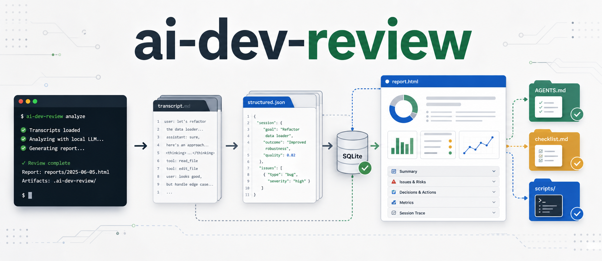
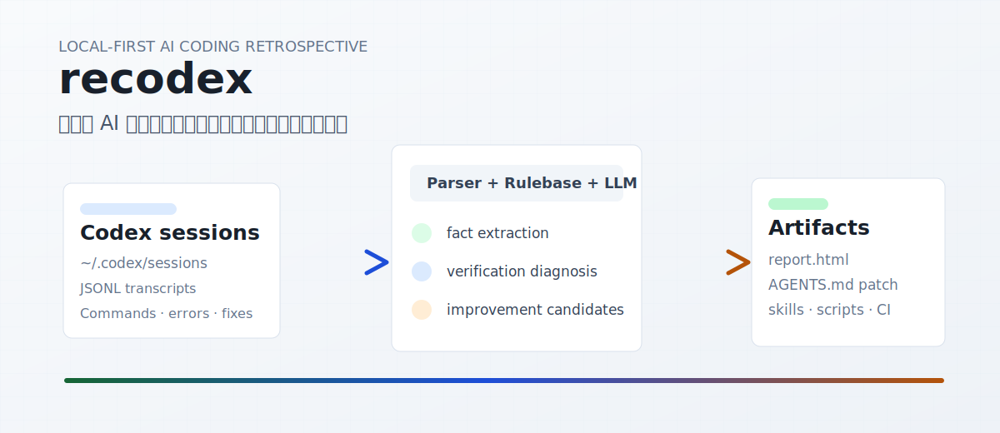
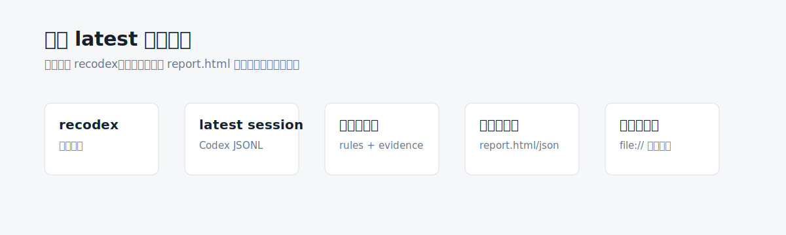
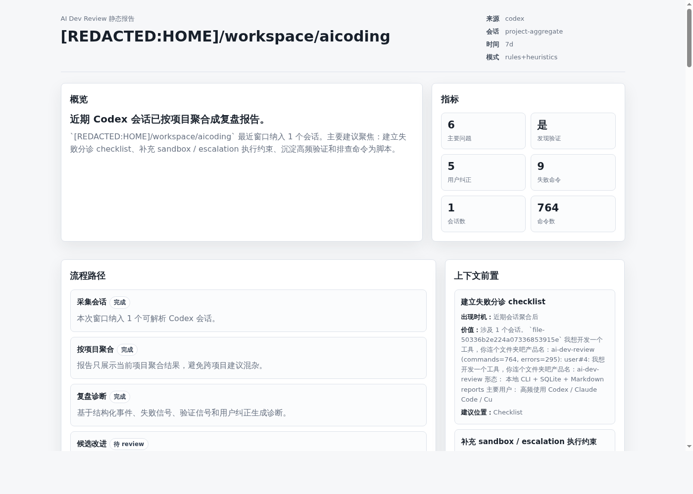
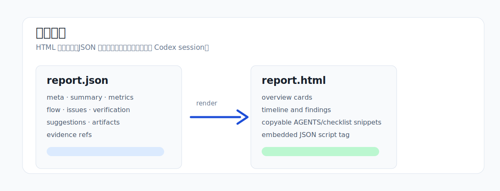
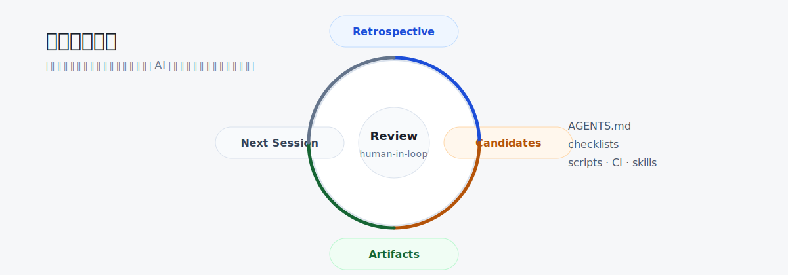
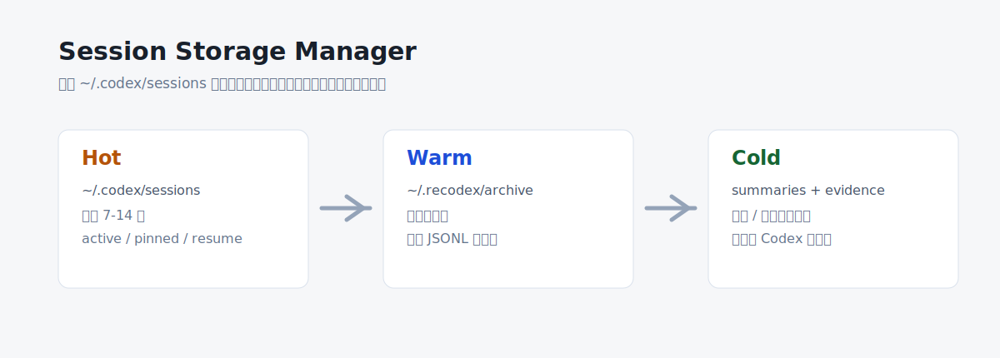
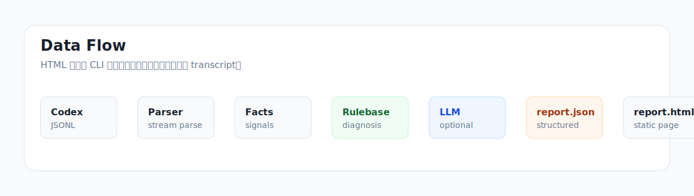
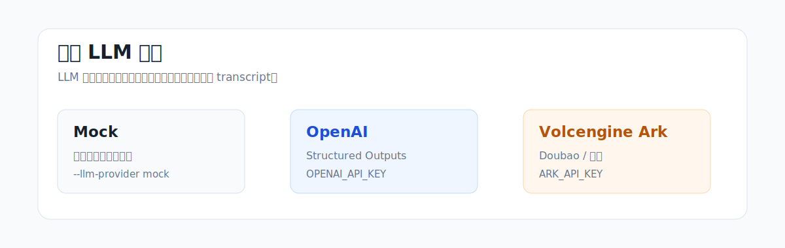

# ai-dev-review

[English](README.en.md) | 中文

> 复盘你的 AI 编程会话，找出下一次更高效使用 Codex / Claude Code / Cursor 的具体改进点。

`ai-dev-review` 是一个本地优先的 AI 开发复盘 CLI。它读取本地 AI 编程会话记录，结构化分析会话过程，并默认生成静态 HTML 报告和可 review 的工作流改进候选。

第一数据源是 Codex session transcripts。第一默认输出是本地 `report.html`。



它重点分析：

- 哪些上下文给得太晚
- 任务边界是否过大或发生漂移
- 过程中是否应该更早暂停、纠偏或拆分任务
- 收尾是否缺少测试、构建、typecheck、lint 或手动验证证据
- 哪些信息应该沉淀到 `AGENTS.md`、checklist、script、hook、CI 或 skill

它不是聊天记录查看器，不是 prompt 改写器，也不是泛泛的 AI 总结工具。



---

## Demo

直接运行默认流程：

```bash
ai-review
```

默认行为：

```text
Found recent Codex sessions
Grouped sessions by project
Generated retrospectives
Generated project report.json and report.html
Proposed improvement candidates
Exported AGENTS/checklist/script/skill/CI artifacts
```



示例输出：

```text
Quickstart scanned 2 session(s) from the last 7d.

Projects:
Project: /path/to/project
  Reports: .ai-review/reports/projects/project-1234abcd
  Report JSON: .ai-review/reports/projects/project-1234abcd/report.json
  Report HTML: .ai-review/reports/projects/project-1234abcd/report.html
  Exports: .ai-review/exports/quickstart/projects/project-1234abcd
```

真实报告截图：



生成最新会话报告：

```bash
ai-review report latest
```

生成并打开 HTML 报告：

```bash
ai-review report latest --open
```

---

## 为什么做这个

用好 Codex 不只是模型能力问题。

一次混乱的 AI 编程会话，常见原因是 workflow 出了问题：

- 任务开始时上下文不够
- 重要项目规则出现太晚
- 同一个 session 混入调试、重构、部署和文档
- AI 沿错误方向继续探索
- 最终回答说完成，但没有验证证据
- 同一个项目事实被用户重复解释

`ai-dev-review` 把真实 AI 编程会话转成可执行的使用反馈。

核心目标：

> 从自己的 AI 编程会话里，学会下一次怎么更好地使用 AI coding agent。

---

## 会生成什么

默认 quickstart 会按项目写报告和改进资产。

### HTML 报告

`report.html` 是用户看的静态报告。它是一个单文件 HTML，并把结构化 JSON 嵌入页面内部：

```html
<script id="report-data" type="application/json">...</script>
```

页面不扫描 Codex session，也不在运行时 fetch 外部 JSON。CLI 先完成解析和分析，再渲染页面。



### 结构化 JSON

`report.json` 是页面的标准数据源，包含：

- `meta`
- `summary`
- `metrics`
- `flow`
- `issues`
- `context_frontload`
- `intervention`
- `verification`
- `suggestions`
- `artifacts`
- `evidence`

### 改进候选

工具会生成可 review 的改进候选，例如：

- 更新 `AGENTS.md`
- 增加完成前 checklist
- 把重复命令转成脚本
- 建议 hook 或 CI 检查
- 生成可复用 skill

所有改进候选都应先人工确认，再应用或导出。



---

## 它不是什么

`ai-dev-review` 不是：

- 完整 Codex transcript viewer
- prompt rewriting assistant
- 面向用户的规则库管理系统
- 泛用聊天总结器
- 测试或 code review 的替代品
- 判断最终代码是否正确的工具

它分析的是 AI 编程会话周围的 **使用过程**。

---

## 安装

从源码运行：

```bash
git clone git@github.com:wananing/ai-review.git
cd ai-review
uv sync
uv run ai-review
```

不安装直接运行：

```bash
PYTHONPATH=src python3 -m ai_dev_review
```

通过 `uv` 使用 console command：

```bash
uv run ai-review
```

---

## 快速开始

分析最近几个 Codex 会话并生成项目报告：

```bash
ai-review
```

限制扫描窗口：

```bash
ai-review --since 7d --limit 5
```

生成单次会话 HTML 报告：

```bash
ai-review report latest
```

生成并打开单次会话 HTML 报告：

```bash
ai-review report latest --open
```

本地确定性分析：

```bash
ai-review retro latest --local-only
```

使用 mock provider 测试 LLM 分析链路：

```bash
ai-review retro latest --llm --llm-provider mock
```

---

## 核心命令

### `ai-review`

默认 quickstart 流程。它读取最近一个小窗口，按项目聚合会话，生成 HTML 报告，提出改进候选，并导出工作流资产。

```bash
ai-review
```

默认输出：

```text
.ai-review/reports/quickstart-index.md
.ai-review/reports/projects/<project>/
  report.json
  report.html
  retro-*.md
  retro-*.json
  retro-*.html
  patterns-7d.md
  improvements.md
.ai-review/exports/quickstart/projects/<project>/
  AGENTS.patch.md
  skills/ai-dev-review-retro/SKILL.md
  checklists/ai-review-checklist.md
  scripts/ai-review-verify.sh
  ci/verify.yml
```

### `ai-review init`

先 catalog Codex transcript 元数据，不立即完整读取所有 session。适合 `~/.codex/sessions` 很大的场景。

```bash
ai-review init
ai-review init --select 1 --process-limit 20
```

### `ai-review scan`

把 transcript 文件解析进本地 SQLite。

```bash
ai-review scan ~/.codex/sessions
ai-review import ./some-session.jsonl
```

### `ai-review report latest`

为一个已索引 session 生成静态 HTML 报告。

```bash
ai-review report latest
ai-review report latest --open
```

同时会写出匹配的 `retro-*.json` 和 `retro-*.md`。

### `ai-review retro`

生成 Markdown retrospective，并默认生成匹配的 JSON / HTML 文件。

```bash
ai-review retro latest
ai-review retro --since 7d
```

可选 LLM 分析：

```bash
ai-review retro latest --llm --llm-provider mock
ai-review retro latest --llm --allow-cloud
```

### `ai-review patterns --since 30d`

汇总最近会话里的重复模式。

```bash
ai-review patterns --since 30d
```

典型主题：

- 多次会话缺少验证证据
- 项目上下文出现太晚
- sandbox / permission 摩擦重复出现
- 命令失败重复出现
- 用户重复纠正同类问题

### `ai-review improvements`

生成和 review 改进候选。

```bash
ai-review improvements propose --since 30d
ai-review improvements list
ai-review improvements show <id>
ai-review improvements accept <id>
ai-review improvements reject <id>
ai-review improvements apply <id>
```

### `ai-review export`

导出 workflow artifact。

```bash
ai-review export agents
ai-review export skills
ai-review export checklist
ai-review export scripts
ai-review export ci
```

### `ai-review storage`

检查和管理大型 Codex session 存储。

```bash
ai-review storage stats
ai-review storage top --limit 50
ai-review storage index --incremental
ai-review storage archive --older-than 30d --dry-run
ai-review storage archive --older-than 30d
ai-review storage restore <session-id>
ai-review storage vacuum
```



归档命令会把旧 JSONL 移出 Codex 热路径，而不是删除它们。

---

## 报告输出

默认报告目录：

```text
.ai-review/reports/
```

项目级 quickstart 输出：

```text
.ai-review/reports/projects/<project>/
  report.html
  report.json
  retro-*.md
  retro-*.json
  retro-*.html
  patterns-7d.md
  improvements.md
```

单次会话输出：

```text
.ai-review/reports/
  retro-<title>-<session>.md
  retro-<title>-<session>.json
  retro-<title>-<session>.html
```

文件说明：

- `report.html`：用户看的静态 HTML 报告
- `report.json`：结构化分析数据
- `retro-*.md`：Markdown retrospective
- `improvements.md`：可 review 的改进候选
- `patterns-*.md`：跨会话模式摘要

---

## 数据流



```text
Codex session transcript
  ↓
Local parser
  ↓
Fact extraction
  ↓
Rulebase-guided analysis
  ↓
LLM-assisted diagnosis, optional
  ↓
report.json
  ↓
HTML renderer
  ↓
report.html
```

HTML 页面只展示 CLI 生成的结构化分析结果。

---

## 分析关注点

`ai-dev-review` 分析五个使用维度。

### 1. 任务启动

- 初始任务是否足够清楚？
- 任务是否太大？
- 约束是否缺失？
- 完成条件是否不明确？

### 2. 上下文时机

- 哪些重要事实出现太晚？
- 用户是否中途纠正项目路径或命令？
- 稳定上下文是否应该写进 `AGENTS.md`？

### 3. 过程干预

- AI 是否在多次失败后仍继续沿同一方向尝试？
- 是否应该更早暂停并重设假设？
- 会话是否漂移到无关工作？

### 4. 验证和验收

- 是否有 test / build / typecheck / lint / manual verification？
- 最终回答是否包含命令结果？
- 是否在没有证据时接受“完成”？

### 5. 可复用改进

- 项目命令是否应该被文档化？
- 是否应该创建 checklist？
- 重复命令是否应该脚本化？
- 重复验证缺口是否应该升级为 hook 或 CI？

---

## 示例 Finding

```text
Problem:
关键上下文补充偏晚

Observation:
测试命令和主要代码目录是在会话中段才出现的，AI 前期产生了不必要的探索。

Impact:
这会增加轮次、token 消耗和方向偏差风险。

Suggestion:
把稳定的项目上下文提前放入项目说明，例如测试命令、主要目录和禁止修改范围。
```

---

## 可选 LLM 分析

LLM 分析是 opt-in。默认情况下，`ai-review` 只使用本地确定性解析、规则经验库匹配和启发式建议。



### OpenAI

```bash
export OPENAI_API_KEY=...
ai-review retro latest --llm --allow-cloud
```

### 火山方舟 / 豆包

```bash
export ARK_API_KEY=...
ai-review retro latest --llm --llm-provider volcengine --allow-cloud
```

或写入 `~/.ai-review/config.toml`：

```toml
[analysis]
local_only = false
llm_provider = "volcengine"
# Optional. Defaults to doubao-seed-2-0-lite-260215.
# llm_model = "doubao-seed-2-0-lite-260215"
```

然后只需要配置一个 key：

```bash
export ARK_API_KEY=...
ai-review retro latest --llm
```

火山 provider 默认使用：

```text
https://ark.cn-beijing.volces.com/api/v3
```

---

## 隐私

`ai-dev-review` 是本地优先设计。

默认行为：

- 只读本地 Codex transcripts
- 不修改原始 Codex session 文件
- 报告存储在本地
- 可选 LLM 分析前先脱敏
- `analysis.local_only = true` 时阻止云端 LLM 调用
- 支持 `--local-only`

脱敏范围包括：

- API keys
- tokens
- `.env` 内容
- database URLs
- cookies
- private keys
- authorization headers
- home directory paths
- emails

本地模式：

```bash
ai-review retro latest --local-only
```

---

## 配置

项目配置：`.ai-review.toml`

```toml
[project]
name = "my-project"
root = "."

[sources.codex]
enabled = true
sessions_dir = "~/.codex/sessions"

[privacy]
redact_secrets = true
redact_env_files = true
redact_home_path = true

[analysis]
local_only = true
max_session_tokens = 80000
# llm_provider = "volcengine"
# llm_model = "doubao-seed-2-0-lite-260215"
# llm_api_key_env = "ARK_API_KEY"

[outputs]
reports_dir = "./.ai-review/reports"
agents_md = "./AGENTS.md"
skills_dir = "./.agents/skills"
checklists_dir = "./docs/ai-checklists"
scripts_dir = "./scripts/ai"
```

全局配置：`~/.ai-review/config.toml`

```toml
[analysis]
local_only = false
llm_provider = "volcengine"
llm_api_key_env = "ARK_API_KEY"
```

---

## 规则经验库

`ai-dev-review` 使用内置规则经验库作为复盘和改进建议的内部判断层。

它不是独立的用户规则管理命令。报告也不会单独展示“命中规则”。规则经验库只在内部用于保证分析稳定、可追溯、证据驱动。

覆盖范围包括：

- prompt quality
- task planning
- bugfix workflow
- verification
- context management
- tool usage
- user correction
- project memory
- automation
- safety
- reviewability
- productivity metrics

---

## Roadmap

### v0.1 Codex Local Review

- [x] 读取本地 Codex sessions
- [x] SQLite 索引
- [x] CLI scan/list/search
- [x] Markdown retrospective reports

### v0.2 HTML Reports

- [x] 生成 `report.json`
- [x] 渲染静态 `report.html`
- [x] 单文件 HTML 内嵌 JSON
- [x] 默认生成 HTML

### v0.3 Improvement Engine

- [x] 跨会话 pattern report
- [x] improvement candidates
- [x] review queue
- [x] AGENTS/checklist/script/skill/CI exporters

### v0.4 Storage Manager

- [x] 增量 raw session index
- [x] storage stats 和 largest files
- [x] archive / restore old Codex sessions
- [x] hot/warm/cold storage direction

### v0.5 LLM Gateway

- [x] Mock provider for tests
- [x] OpenAI provider
- [x] Volcengine Ark / Doubao provider
- [x] Structured JSON output validation
- [ ] Batch analysis
- [ ] Eval suite

### v0.6 Cross-Agent

- [ ] Claude Code adapter
- [ ] Cursor adapter
- [ ] Git / GitHub adapter
- [ ] CI logs adapter

---

## FAQ

### 这是 prompt optimizer 吗？

不是。它可能会发现某些信息应该更早给到 AI，但产品中心不是改写 prompt。

它关注的是完整 AI 编程使用过程：上下文、任务边界、过程干预、验证和可复用改进。

### 它会判断最终代码是否正确吗？

不会。它检查的是 session 是否产生了足够的验证证据。

如果 AI 改了代码但没有运行测试、构建、typecheck、lint 或手动验证，报告会降低完成可信度。

### 它会上传 Codex sessions 吗？

默认不会。

默认路径是本地确定性分析。启用 LLM 分析时，工具发送的是脱敏后的紧凑分析包，而不是完整原始 transcript。

### 它会替代 `AGENTS.md` 或 skills 吗？

不会。

它可能建议把什么写进 `AGENTS.md`、checklist、script、hook、CI 或 skill，但每个改进都应该先 review。

### 为什么默认生成 HTML？

终端适合快速摘要，但不适合阅读结构化复盘。

HTML 更适合浏览、保存、分享、打印，也适合附到 issue 或笔记里。

---

## 开发

运行测试：

```bash
PYTHONPATH=src python3 -m unittest discover -s tests
python3 -m py_compile src/ai_dev_review/*.py
```

从源码运行：

```bash
PYTHONPATH=src python3 -m ai_dev_review
```

通过 `uv` 运行：

```bash
uv run ai-review
```

---

## License

MIT
