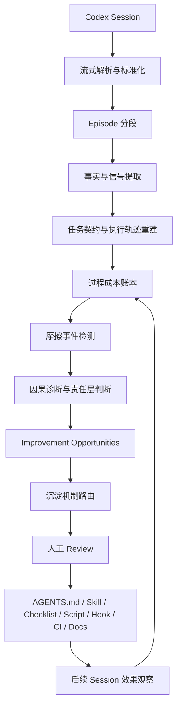
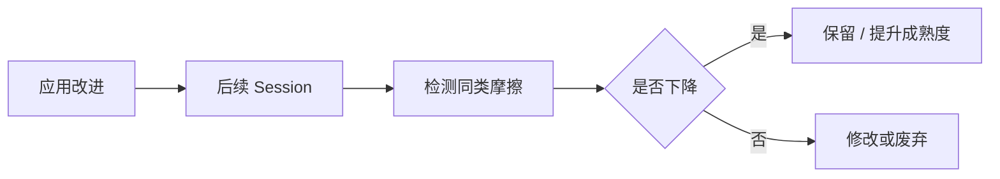

# recodex 核心分析与改进沉淀架构设计

**版本：** v1.0 讨论稿
**适用对象：** 产品、架构、算法、LLM 工程、报告设计、开源协作者
**文档目的：** 重新定义 recodex 的两个核心能力，并给出可落地的分析策略、数据模型、LLM 架构、报告结构与实施路线。

---

## 1. 产品定义

recodex 不是聊天记录查看器，不是 Prompt 优化器，也不是把 session 丢给 LLM 后生成一篇摘要的包装工具。

recodex 的产品目标是：

> 从真实的 Codex 会话中，找出人与 Codex 协作过程中最昂贵、最可避免的效率摩擦；给出最高杠杆的改进动作，并判断这些改进应该沉淀到哪里。

产品包含两个相互衔接、但职责不同的核心：

### 核心一：协作效率诊断

分析一次或多次会话，回答：

- 哪些成本是必要的，哪些成本可以避免？
- 哪些信息发现得太晚，并实际造成了返工或额外轮次？
- Codex 是否在失败后更新了假设，还是进入重复试错？
- 用户的干预是否及时、有效，还是过晚或过密？
- 哪些验证工作被转移给用户，增加了监督成本？
- 本次最值得优先改变的一个动作是什么？

### 核心二：改进机制路由与沉淀

把核心一产生的改进机会进一步判断为：

- 只需要给用户一次建议；
- 应写入 `AGENTS.md`；
- 应写入项目文档或运行手册；
- 应生成 checklist；
- 应生成 script；
- 应生成 hook 或 CI；
- 应生成 skill；
- 应通过 MCP 或其他集成自动提供动态信息；
- 或者不应沉淀，因为它只是一次性情况。

二者的关系是：

```text
会话事实
  ↓
效率摩擦与可避免成本
  ↓
因果诊断
  ↓
改进机会
  ↓
沉淀机制路由
  ↓
人工 Review
  ↓
应用并观察后续效果
```

---

## 2. 核心设计原则

### 2.1 以成本为起点，而不是以规则为起点

错误的分析方式：

```text
规则：测试命令应该提前提供
→ 会话中测试命令出现较晚
→ 结论：用户上下文给晚了
```

推荐方式：

```text
前 8 轮在错误 workspace 探索
→ 3 次测试命令失败
→ 第 9 轮才出现正确测试入口
→ 前述探索没有贡献到最终结果
→ 根因：稳定项目知识没有进入默认上下文
→ 改进：写入 AGENTS.md
```

规则经验库应当用于解释、校准和推荐机制，而不是决定会话一定“违反了什么”。

### 2.2 分析对象是协作系统，不是单独责怪用户或 Codex

同一个问题可能来自不同层：

- 用户没有说明业务意图；
- Codex 没有主动探索项目已有脚本；
- 项目没有文档化测试入口；
- `AGENTS.md` 内容缺失；
- 测试基础设施过慢；
- 权限或 sandbox 反复阻碍执行。

报告必须判断主要改进发生在哪一层，而不是把所有问题写成“用户下次应该说清楚”。

### 2.3 事实由程序负责，解释由 LLM 负责

程序负责：

- 解析 JSONL；
- 统计轮次、命令、失败、重复读取；
- 识别 test/build/lint/typecheck；
- 识别文件变更和命令退出码；
- 建立时间线和证据引用；
- 脱敏、缓存、增量处理。

LLM 负责：

- 解释任务契约如何演化；
- 判断某段探索是否必要；
- 识别失败循环背后的假设停滞；
- 判断用户干预的价值与时机；
- 合并摩擦事件；
- 推断最可能根因；
- 生成少量、具体、可执行的建议。

### 2.4 所有结论必须可追溯

每个 Finding 必须绑定：

- 原始事件 ID；
- 文件位置或 byte offset；
- 关键证据片段；
- 结论为何由这些证据支持；
- 置信度与不确定性。

没有证据的泛泛建议不应进入最终报告。

### 2.5 默认只展示最高杠杆改进

报告默认应限制为：

- Top 3 主要问题；
- Top 1 首要改进；
- Top 3 值得保留的做法；
- 最多 3 个沉淀候选。

recodex 的价值不是列出更多问题，而是找到最值得先改的少数动作。

### 2.6 沉淀必须有人审

任何 `AGENTS.md`、skill、hook、CI、script 建议都必须经过用户确认。

系统不应把一次临时 workaround 自动升级为长期规范。

---

## 3. 统一术语

### Session

一份 Codex 会话原始记录，可能很短，也可能包含多个任务和数百 MB 工具输出。

### Episode

Session 中表达一个局部意图和结果的阶段，例如探索、实现、失败循环、用户纠正、验证。

### Signal

程序可确定的事实信号，例如失败命令、重复读取、用户纠正、缺少验证。

### Friction Event

对效率产生影响的具体事件，例如测试入口发现过晚、相同错误重复出现、用户在大量改动后才纠偏。

### Cost Ledger

记录会话中可观察成本及其证据的账本。

### Finding

经过证据审计后确认的主要问题诊断。

### Improvement Opportunity

由 Finding 推导出的高杠杆改进机会，包含原因、责任层、建议动作和沉淀方向。

### Artifact Candidate

具体的沉淀候选，例如一个 `AGENTS.md` 片段、一份 checklist、一个 skill 草稿。

---

## 4. 两个核心的完整闭环



核心一结束于 `Improvement Opportunity`。
核心二从 `Improvement Opportunity` 开始，决定如何沉淀以及是否沉淀。

---

# 第一部分：核心一——协作效率诊断

## 5. 效率的定义

recodex 不应该简单用“轮次越少越高效”来判断效率。

复杂任务需要探索，失败也可能有效地排除假设。真正应该分析的是：

> 为达到被用户接受、且有验证证据的结果，产生了多少必要成本与可避免成本。

### 5.1 终点定义

效率分析的终点不是 Codex 输出“已完成”，而是：

```text
被用户接受的结果
+ 足够的验证证据
+ 明确的未完成项和风险
```

建议采用：

```text
Time to Accepted and Evidenced Result
```

即“达到可接受且有证据结果的时间”。

### 5.2 成本分级

每段工作可标注为：

- `necessary`：任务本身需要；
- `useful_exploration`：虽然未直接产出，但有效缩小了搜索空间；
- `potentially_avoidable`：可能通过更好上下文或流程减少；
- `clearly_avoidable`：后来被纠正、撤销、重复或证明无贡献；
- `unknown`：证据不足。

报告只应重点讨论 `potentially_avoidable` 和 `clearly_avoidable`。

---

## 6. 第一核心的分析主线

```text
任务契约
→ 执行轨迹
→ 过程成本
→ 摩擦事件
→ 因果诊断
→ 责任层
→ 最高杠杆动作
```

### 6.1 重建任务契约

需要重建：

- 最终目标；
- 范围；
- 约束；
- 完成条件；
- 优先级；
- 任务过程中发生的变化；
- 哪些内容由用户提供，哪些由 Codex 发现。

重点不是判断初始 Prompt 是否“完整”，而是判断：

- 任务契约经过多少轮才稳定；
- 契约变化是否造成返工；
- 缺失信息是否可以由 Codex 自行发现；
- 信息属于一次性业务意图，还是稳定项目知识。

### 6.2 重建执行轨迹

把 Session 拆成 Episode：

```text
提出任务
探索
计划
实现
失败循环
用户纠正
重新定位
验证
收尾
主题切换
```

每个 Episode 记录：

- 局部目标；
- 输入信息；
- 关键动作；
- 输出结论；
- 是否推进最终结果；
- 是否改变后续决策；
- 是否被撤销或纠正；
- 关键证据。

### 6.3 构建过程成本账本

建议记录以下成本。

| 成本类型 | 可观察指标 | 典型问题 |
|---|---|---|
| 时间成本 | 总时长、阶段时长、等待时长 | 失败循环持续过久 |
| 交互成本 | 用户轮次、澄清、纠正 | 稳定事实反复解释 |
| 工具成本 | 命令数、失败命令、重复命令 | 同命令无变化重跑 |
| 上下文成本 | 文件读取、重复读取、日志大小 | 大量无关输出污染上下文 |
| 返工成本 | 撤销改动、重写、错误路径修改 | 晚出现的约束改变方案 |
| 监督成本 | 用户介入次数、介入密度 | 用户持续微观指挥 |
| 验收成本 | 用户追问、重跑测试、手工验证 | 证据没有由 Codex 提供 |

成本账本不应伪装成精确财务数字。能够确定的用事实值；只能估计的必须标注为估计及置信度。

---

## 7. 第一版重点支持的八类效率发现

## 7.1 稳定项目信息发现过晚

### 关注问题

- 项目测试命令、目录结构、服务名、架构边界何时出现？
- Codex 是否本可从项目文件自行发现？
- 晚出现是否导致失败命令、错误目录探索或返工？

### 典型证据

```text
前 6 轮在错误目录搜索
3 次命令因 workspace 错误失败
用户第 7 轮提供正确路径
后续立即收敛
```

### 可能根因

- 项目文档缺失；
- `AGENTS.md` 缺失；
- Codex 没有先读取已有脚本；
- 用户掌握但项目中不可发现的业务约束。

### 可能落点

`AGENTS.md`、项目文档、自动上下文注入、MCP。

---

## 7.2 任务边界在过程中漂移

### 关注问题

- 是否从 bugfix 漂移到重构、优化、部署或文档？
- 漂移是必要发现，还是无确认扩展？
- 是否增加了无关文件修改和验证范围？

### 典型证据

- 初始目标只有一个；
- 中途新增多个次要目标；
- 无用户确认；
- 最终主要任务仍未闭环。

### 可能落点

用户建议、`AGENTS.md` 范围规则、阶段性 checklist、复杂任务 skill。

---

## 7.3 相同失败重复，但假设没有更新

### 关注问题

- 相同错误是否重复出现？
- 每次失败后是否读取和利用错误信息？
- 新尝试是否真正对应新假设？

### 有效失败

```text
失败
→ 排除一个假设
→ 缩小范围
→ 新动作明显改变
```

### 无效失败

```text
失败
→ 不解释原因
→ 换一个相似写法
→ 再次失败
```

### 可能落点

调试 skill、失败重置 checklist、Agent 行为建议、hook 提醒。

---

## 7.4 工具输出没有用于下一步决策

### 关注问题

- 命令已给出关键错误，但后续未引用；
- 读取文件后没有形成结论；
- 大量日志进入上下文，但只使用极少内容；
- 工具调用没有影响后续动作。

### 可能落点

Agent 分析策略、日志切片脚本、工具结果摘要器、skill。

---

## 7.5 探索范围过宽，且没有阶段性结论

探索本身不是浪费。以下情况才是问题：

- 重复搜索同一概念；
- 已确认入口后继续广泛读取；
- 读取很多文件但没有形成“当前已知/未知”；
- 跨目录跳转却没有更新假设；
- 一个调查任务污染整个主会话。

### 可能落点

探索 skill、只读子任务、阶段性总结模板、项目索引。

---

## 7.6 高价值用户干预发生过晚

### 关注问题

- 用户提供的某条信息是否立即改变方案？
- 在该信息出现前是否已经产生大量工作？
- 这条信息是一次性意图，还是应长期保存？

### 报告表达

不应只说“用户应该更早干预”，而应说：

> 第 12 轮出现的兼容性约束直接改变实现方向。如果该约束成为项目持久信息，可以避免前述两次实现回退。

### 可能落点

`AGENTS.md`、项目文档、任务模板、动态上下文。

---

## 7.7 用户监督过密，形成微观管理

### 关注问题

- 用户是否逐条指定文件、命令和修改，而 Codex 无法形成完整计划？
- 大量用户消息是否只是推进下一小步？
- 是否应该先让 Codex 完成一段有边界的工作再 Review？

### 注意

频繁交互不一定低效。若任务高风险、反馈高价值，则属于必要监督。

### 可能落点

用户建议、任务拆分方式、阶段性验收、权限策略。

---

## 7.8 完成缺少证据，验证成本被转移给用户

### 关注问题

- Codex 是否运行相关验证？
- 是否展示命令、结果和失败项？
- 用户是否需要追问或自行重跑？
- 是否过度重复验证？

### 典型成本

```text
Codex 说已完成
→ 用户追问是否测试
→ 用户自行执行测试
→ 发现问题
→ 会话重新打开
```

### 可能落点

`AGENTS.md` 完成定义、checklist、hook、CI、测试脚本。

---

## 8. 信息来源与责任归属

每个关键信息应先分类。

| 信息类型 | 谁应主要负责 | 示例 |
|---|---|---|
| 用户必须提供 | Operator | 业务意图、优先级、不可见约束 |
| Agent 应自行发现 | Agent | 目录结构、已有脚本、调用关系 |
| 项目长期保存 | Project | 构建命令、架构边界、服务名 |
| Harness 自动注入 | Harness | AGENTS.md、skills、hooks、权限 |
| 环境自动提供 | Environment | CI 状态、分支、依赖、运行环境 |

### 责任层

Finding 可对应一个或多个责任层：

```text
Operator
Agent
Project
Harness
Environment
```

报告中不必使用“责任”一词，可以显示为：

```text
最适合改进的位置：项目说明 / Agent 配置
```

---

## 9. 因果诊断流程

对每个摩擦事件执行：

1. **观察：** 发生了什么？
2. **成本：** 产生了哪些轮次、时间、工具、返工或监督成本？
3. **转折：** 哪个后续事件改变了方向或暴露了问题？
4. **可发现性：** 缺失信息能否由 Codex 自行发现？
5. **反事实：** 如果某信息或机制更早存在，哪些成本可能被避免？
6. **根因：** 更可能是用户、Agent、项目、Harness 还是环境问题？
7. **行动：** 什么是成本最低、收益最高的改进？
8. **证据审计：** 证据是否足以支持上述判断？

不得仅凭“看起来符合最佳实践”推断因果。

---

## 10. Improvement Opportunity 模型

```yaml
id: opp_test_entry_discovery

title: 测试入口发现成本过高
category: stable_project_context_late

observation:
  正确测试命令在第 9 轮才出现。

observed_cost:
  failed_commands: 3
  wrong_workspace_switches: 2
  extra_turns: 6
  estimated_minutes: 11

cause:
  summary: 稳定项目知识没有进入 Codex 默认上下文
  confidence: 0.94

responsibility_layers:
  - project
  - harness

preventability: high
recurrence: 3_of_last_5_sessions

impact:
  延迟首次有效验证，并增加用户纠正成本。

best_action:
  将 workspace 范围和标准测试命令写入 AGENTS.md。

recommended_mechanism:
  type: project_instruction
  target: AGENTS.md

evidence_refs:
  - ev_18
  - ev_31
  - ev_46
```

### 内部优先级

可以使用内部排序：

```text
Priority ≈ Impact × Preventability × Recurrence × Confidence ÷ Effort
```

该值只用于排序，不应在用户报告里显示为伪精确评分。

---

# 第二部分：核心二——改进机制路由与沉淀

## 11. 为什么不是所有问题都生成 Skill

Skill 适合“有明确触发场景、包含多步骤判断、可重复执行”的流程。

以下内容不适合 Skill：

- 一个稳定项目事实；
- 一个简单命令；
- 必须确定性执行的安全检查；
- 一次性用户偏好；
- 单纯提醒“记得跑测试”。

错误做法：

```text
发现问题
→ 自动生成 Skill
```

正确做法：

```text
发现问题
→ 判断根因与重复性
→ 选择最合适的机制
→ 人工 Review
```

---

## 12. 沉淀机制决策表

| 改进类型 | 最合适机制 | 典型例子 |
|---|---|---|
| 一次性使用行为 | 用户建议 | 本次任务应更早拆分 |
| 稳定项目事实 | AGENTS.md / 项目文档 | 测试命令、目录、服务名 |
| 大段背景知识 | references / docs | 架构说明、历史决策 |
| 多步骤条件流程 | Skill | 部署排错、迁移、复杂 review |
| 固定命令序列 | Script | 构建、重启、日志检查 |
| 经常漏做的步骤 | Checklist | PR 前验证、部署验收 |
| 必须强制执行 | Hook / CI / Policy | typecheck、secret scan |
| 动态外部信息 | MCP / Integration | CI 状态、Issue、监控数据 |
| 团队级标准 | Docs + CI/Rule | 代码规范、安全要求 |
| 过时或冲突知识 | 更新/删除 | 旧测试命令、旧目录 |

---

## 13. Skill 升级门槛

一个 Improvement Opportunity 只有同时满足多数条件时才建议 Skill：

- 有明确触发场景；
- 包含多个步骤；
- 步骤之间存在判断或分支；
- 在不同 Session 中重复出现；
- 不能被一个简单脚本完全替代；
- 不只是静态项目事实；
- 有明确输入、输出和验证方式；
- 已有真实会话证据证明流程有效；
- 不会把临时 workaround 固化为长期行为。

### 不应生成 Skill 的例子

```text
“运行 pnpm typecheck”
```

更适合：`AGENTS.md`、checklist 或 CI。

### 适合 Skill 的例子

```text
“在该项目中排查 Spring Boot 部署失败：
确认构建产物 → 检查端口 → 检查服务状态 → 读取日志 → 健康检查 → 回滚判断”
```

---

## 14. Artifact Candidate 生命周期

```text
proposed
→ reviewed
→ accepted / rejected
→ generated
→ installed
→ observed
→ updated / deprecated
```

每个 Artifact Candidate 应保留：

- 来源 Finding；
- 来源 Session；
- 证据；
- 适用范围；
- 风险；
- 最后验证时间；
- 后续效果。

---

## 15. 沉淀后效果验证

这是 recodex 可以形成长期壁垒的部分。

例如应用 `AGENTS.md` 后，应观察：

```text
测试入口发现轮次是否下降
错误 workspace 命令是否减少
用户纠正次数是否减少
首次有效验证是否更早
```

Artifact 不应只被“生成”，而应被评估是否真正减少了对应摩擦。



---

# 第三部分：系统架构

## 16. 大型 Session 分析架构

```text
原始 JSONL
→ 流式读取
→ 标准化事件
→ Episode 分段
→ 确定性信号
→ 分层摘要
→ 多维分析
→ 原始证据重新取回
→ Evidence Auditor
→ Improvement Opportunities
→ 沉淀机制路由
→ report.json / report.html
```

### 多分辨率数据层

```text
L0 原始 JSONL
L1 标准化事件
L2 Episode 事实与摘要
L3 Session Map 与成本账本
L4 Audited Findings
L5 Improvement Opportunities 与 Artifact Candidates
```

LLM 默认读取 L2-L4；只有取证时回到 L0。

---

## 17. 核心组件

```text
recodex/
├── ingestion/
│   ├── codex_parser.py
│   ├── incremental_reader.py
│   └── normalizer.py
├── segmentation/
│   ├── episode_segmenter.py
│   └── phase_builder.py
├── signals/
│   ├── commands.py
│   ├── corrections.py
│   ├── verification.py
│   ├── context.py
│   └── file_activity.py
├── evidence/
│   ├── store.py
│   ├── selector.py
│   ├── rehydrator.py
│   └── auditor.py
├── analysis/
│   ├── contract.py
│   ├── cost_ledger.py
│   ├── friction_detector.py
│   ├── cause_diagnosis.py
│   ├── responsibility.py
│   └── opportunity_ranker.py
├── routing/
│   ├── artifact_router.py
│   ├── skill_gate.py
│   └── lifecycle.py
├── llm/
│   ├── gateway.py
│   ├── structured_output.py
│   ├── model_router.py
│   └── cache.py
├── reports/
│   ├── schema.py
│   ├── composer.py
│   └── html_renderer.py
└── evals/
    ├── datasets/
    ├── graders.py
    └── runner.py
```

---

## 18. Quick 与 Deep 模式

## Quick

```bash
recodex
```

目标：

- 最新一个主任务；
- 确定性检测为主；
- 少量 LLM 调用；
- Top 3 问题；
- Top 1 改进；
- 默认生成并打开 HTML；
- 目标耗时 10-30 秒。

## Deep

```bash
recodex --deep
```

能力：

- 全部 Episode；
- 多维并行分析；
- 跨阶段因果关系；
- Evidence Rehydration；
- Evidence Auditor；
- 沉淀机制路由；
- 可恢复后台任务。

二者共用同一套 Event、Episode、Evidence、Report Schema。

---

## 19. LLM 的角色

LLM 不应自由读取整个仓库并自行决定如何分析。

推荐固定工作流：

```text
Task Contract Analyzer
Process Analyzer
Context Analyzer
Hypothesis / Failure Analyzer
Supervision Analyzer
Verification Analyzer
Finding Merger
Evidence Auditor
Recommendation Generator
Artifact Router
```

所有节点输出结构化 JSON，经 Pydantic/JSON Schema 校验。

### LangGraph 的位置

- Quick 模式不需要 LangGraph；
- Deep 模式出现并行、重试、checkpoint、人工介入时，可用 LangGraph；
- 使用固定 Graph，不使用无限自由 Agent Loop。

### Deep Research 的位置

Deep Research 不用于每次 Session。

它适合定期更新规则经验库：

```text
官方文档 / 社区实践 / 研究
→ 研究与综合
→ 新规则候选
→ 人工 Review
→ rulebase 新版本
```

---

# 第四部分：数据模型

## 20. EvidenceRef

```python
class EvidenceRef(BaseModel):
    id: str
    session_id: str
    event_id: str
    source_file: str
    byte_start: int
    byte_end: int
    quote: str
    reason: str
    content_hash: str
```

## 21. CostLedger

```python
class CostLedger(BaseModel):
    total_duration_seconds: int | None
    extra_turns: int
    failed_commands: int
    repeated_commands: int
    repeated_file_reads: int
    user_corrections: int
    reverted_changes: int
    ignored_tool_results: int
    verification_followups: int

    clearly_avoidable_events: list[str]
    potentially_avoidable_events: list[str]
```

## 22. Finding

```python
class Finding(BaseModel):
    id: str
    title: str
    category: str
    severity: str
    confidence: float

    observation: str
    observed_cost: dict
    cause: str
    responsibility_layers: list[str]
    impact: str
    recommendation: str

    evidence_refs: list[str]
```

## 23. ImprovementOpportunity

```python
class ImprovementOpportunity(BaseModel):
    id: str
    source_finding_ids: list[str]

    title: str
    problem: str
    cause: str
    recurrence: str
    preventability: str
    impact: str
    confidence: float

    best_action: str
    recommended_mechanism: str
    suggested_target: str | None

    evidence_refs: list[str]
```

## 24. ArtifactCandidate

```python
class ArtifactCandidate(BaseModel):
    id: str
    opportunity_id: str

    artifact_type: str
    target_path: str | None
    proposed_content: str

    scope: str
    rationale: str
    risks: list[str]
    validation_plan: list[str]

    status: str
    last_verified_at: datetime | None
```

---

# 第五部分：规则经验库的新位置

## 25. 规则经验库不再是分析起点

旧：

```text
规则 → 会话匹配 → 问题
```

新：

```text
事实与轨迹
→ 摩擦与成本
→ 原因假设
→ 规则经验库帮助解释和选择机制
→ 原始证据验证
```

规则经验库主要提供：

1. **诊断知识：** 某类摩擦可能有哪些原因；
2. **机制知识：** 某类改进最适合落到哪里；
3. **风险知识：** 哪些建议不应自动应用；
4. **失效知识：** 哪些规则可能过时或不适用。

用户报告不展示规则编号。

---

# 第六部分：报告设计

## 26. 首屏必须回答四件事

1. 本次任务最终结果如何？
2. 最大可避免成本是什么？
3. 最可能根因是什么？
4. 最值得先做的一个改进是什么？

示例：

```text
本次最大可避免成本

正确测试入口发现过晚，造成：
- 3 次失败命令
- 2 次错误目录探索
- 1 次用户纠偏
- 约 11 分钟无效循环

主要成因
稳定项目知识没有进入 Codex 默认上下文。

首要改进
把 workspace 范围和标准测试命令写入 AGENTS.md。
```

这比抽象的“上下文评分 45/100”更有说服力。

---

## 27. 推荐报告结构

### 1. 总体结论

- 最终结果；
- 完成可信度；
- 最大摩擦；
- 首要改进。

### 2. 可避免成本

- 失败命令；
- 重复探索；
- 用户纠正；
- 返工；
- 验证转移。

### 3. 流程轨迹

显示 Episode 和关键转折，而不是完整聊天回放。

### 4. Top 3 Improvement Opportunities

每项包含：

- 观察；
- 成本；
- 原因；
- 最佳行动；
- 最适合改进的位置；
- 证据。

### 5. 首要沉淀候选

展示 `AGENTS.md`、checklist、skill 等候选，但默认不自动应用。

### 6. 验收证据

显示哪些验证已运行、缺失、失败，以及用户是否需要自行补做。

### 7. 值得保留的做法

识别有效的任务拆分、及时纠偏、方案对比、验证行为。

### 8. 证据附录

默认折叠。

---

## 28. 报告语气

避免：

```text
你的 Prompt 太差
用户没有及时干预
你违反了规则
```

推荐：

```text
关键业务约束在实现后才出现，导致方案回退。
该信息属于稳定项目知识，更适合进入项目说明，而不是每次人工补充。
```

报告应像工程复盘，不像考试评分或行为审判。

---

# 第七部分：质量评估

## 29. Golden Session 数据集

准备真实脱敏案例：

- 稳定知识晚出现；
- 任务漂移；
- 重复失败无假设更新；
- 工具结果被忽略；
- 过宽探索；
- 干预过晚；
- 监督过密；
- 验证转移；
- 高效成功案例；
- 必要探索但不应误报。

每个案例标注：

```text
应发现问题
不应发现问题
关键证据
责任层
建议机制
```

## 30. Eval 指标

- Finding precision；
- Finding recall；
- Evidence correctness；
- Cause plausibility；
- Actionability；
- Responsibility fairness；
- Artifact routing accuracy；
- No generic advice；
- No rule leakage；
- Stability across model versions；
- Analysis cost and latency。

### 关键保护指标

```text
必要探索误判率
```

recodex 不能把所有读取、失败和长会话都判断成低效。

---

# 第八部分：MVP 与实施路线

## 31. MVP 范围

第一版重点支持八类效率发现：

1. 稳定项目信息发现过晚；
2. 任务范围漂移；
3. 重复失败且假设未更新；
4. 工具输出未用于后续决策；
5. 探索过宽且无阶段结论；
6. 高价值用户干预发生过晚；
7. 用户监督过密；
8. 验证成本转移给用户。

首批沉淀路由：

```text
用户建议
AGENTS.md
项目文档
Checklist
Script
Hook / CI
Skill
```

---

## 32. 开发阶段

### Phase 1：事实基础

- 流式 JSONL parser；
- 标准事件模型；
- byte offset evidence refs；
- 命令、失败、文件、验证、纠正信号；
- 增量索引。

### Phase 2：Episode 与成本账本

- Episode Segmenter；
- 任务契约演化；
- 过程成本账本；
- 必要/可避免工作分类。

### Phase 3：LLM 因果诊断

- 多维 Analyzer；
- FindingCandidate；
- Evidence Rehydration；
- Evidence Auditor；
- Top Opportunity 排序。

### Phase 4：沉淀机制路由

- Artifact Router；
- Skill Gate；
- AGENTS/checklist/script 生成；
- 人工 Review 队列。

### Phase 5：跨 Session 效果闭环

- 重复模式；
- Artifact 应用前后对比；
- 规则成熟度；
- 过时规则发现；
- 团队级报告。

---

# 第九部分：完整示例

## 33. 输入轨迹

```text
第 1 轮：用户要求修复 auth 测试失败
第 2-5 轮：Codex 在仓库根目录寻找测试入口
第 6 轮：运行 npm test，失败
第 7 轮：再次使用相似命令，失败
第 8 轮：读取无关 package
第 9 轮：用户说明项目使用 pnpm workspace，命令为 pnpm test:auth
第 10-12 轮：Codex 正确执行测试并修改代码
第 13 轮：Codex 宣布完成，但未运行 typecheck
第 14 轮：用户追问 typecheck
第 15 轮：运行 typecheck，发现错误并修复
```

## 34. 核心一输出

### Opportunity A：测试入口发现成本过高

```text
观察：正确测试命令在第 9 轮才出现。
成本：2 次失败命令、1 次无关目录读取、约 7 个额外轮次。
根因：稳定项目知识未进入默认上下文；Codex 也未优先读取 workspace 配置。
责任层：Project + Harness + Agent。
最佳行动：在 AGENTS.md 写入 workspace 和标准测试命令；探索阶段优先读取 package scripts。
```

### Opportunity B：完成缺少验证证据

```text
观察：Codex 在未运行 typecheck 时宣布完成。
成本：用户追问一次，重新打开实现并产生额外修复。
根因：完成定义没有绑定标准验证命令。
责任层：Harness。
最佳行动：把 typecheck 加入完成 checklist 或 CI。
```

## 35. 核心二路由

| Opportunity | 路由 |
|---|---|
| workspace 和标准测试命令 | AGENTS.md |
| 优先读取项目脚本的探索步骤 | 调试 Skill 或 Agent 规则 |
| typecheck 完成门槛 | Checklist + CI |
| 用户本次追问方式 | 不沉淀，仅作为使用建议 |

### 为什么不把全部生成 Skill

因为测试命令是静态事实，typecheck 是确定性检查。只有“如何在 monorepo 中定位并执行相关测试”的多步骤判断流程可能适合 Skill。

---

# 第十部分：最终决策摘要

## 36. 第一核心的新定义

> recodex 通过重建任务契约、执行轨迹和过程成本，识别人与 Codex 协作中最昂贵、最可避免的摩擦，并给出最高杠杆改进动作。

## 37. 第二核心的新定义

> recodex 不默认生成 Skill，而是根据改进问题的性质、重复性、确定性和适用范围，将其路由到最合适的沉淀机制，并通过后续会话验证效果。

## 38. 产品差异化

普通 Session 工具回答：

```text
这次聊了什么？
```

普通规则检查器回答：

```text
这次违反了哪些最佳实践？
```

recodex 应回答：

```text
这次最昂贵的可避免成本是什么？
为什么发生？
改哪里最划算？
应该沉淀成什么？
沉淀后是否真的减少了同类摩擦？
```

这五个问题构成 recodex 的核心产品价值与长期护城河。
